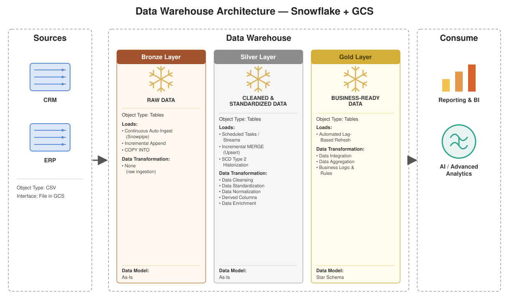
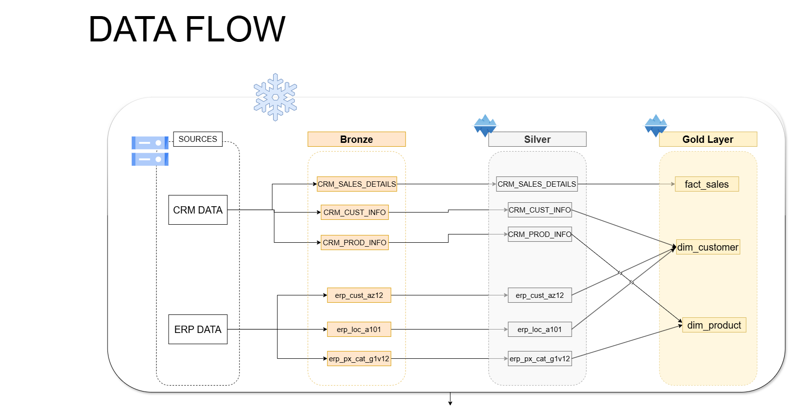
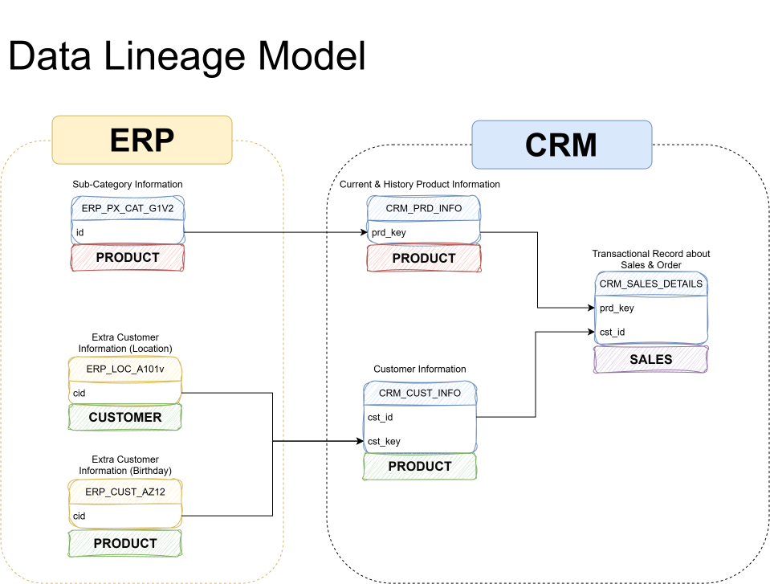

# SQL Warehouse Project

Building a modern data warehouse with **Snowflake** and **GCS**, including ETL, data modeling, and analytics — implemented end-to-end using the **Medallion Architecture** (Bronze → Silver → Gold).

---

## 📖 Overview

This project demonstrates how to design and build a modern cloud data warehouse using **Snowflake** as the compute/storage engine and **Google Cloud Storage (GCS)** as the external data lake, with tables stored in **Apache Iceberg** format. It covers the full pipeline from raw source data to a business-ready dimensional model, along with the analytical queries that model enables.

The project is structured around three layers:

| Layer | Purpose |
|---|---|
| **Bronze** | Raw data ingested as-is from source systems (CRM & ERP CSV extracts) into GCS / Snowflake, no transformations applied. |
| **Silver** | Cleansed, standardized, and conformed data — deduplication, type casting, business rule normalization, and joins prepared for modeling. |
| **Gold** | Business-ready star schema (dimension and fact tables) optimized for reporting, BI tools, and analytics. |

---

## 🏗️ Data Architecture



*Diagram source: [`docs/architecture_diagram.svg`](./docs/architecture_diagram.svg)*

**Storage & Compute:**
- **Warehouse engine:** Snowflake
- **Object storage:** Google Cloud Storage (GCS), configured as a Snowflake External Volume
- **Table format:** Apache Iceberg (Dynamic Iceberg Tables)
- **Refresh strategy:** Snowflake Dynamic Tables with a target lag (auto-refreshing, no manual orchestration required)

---

## 🔄 Data Flow

Table-level view of how each object moves from source through Bronze → Silver → Gold:



- **CRM source** → `crm_sales_details`, `crm_cust_info`, `crm_prd_info`
- **ERP source** → `erp_cust_az12`, `erp_loc_a101`, `erp_px_cat_g1v12`
- Bronze and Silver tables carry the same grain/name as their source; Gold combines and reshapes them into `fact_sales`, `dim_customers`, and `dim_product`.

---

## 🧬 Data Lineage

How individual source tables combine to produce the CRM-side Gold objects:



- `erp_px_cat_g1v2` enriches `crm_prd_info` with category/subcategory data → feeds **`dim_product`**.
- `erp_loc_a101` and `erp_cust_az12` enrich `crm_cust_info` with location and birthdate/gender data → feeds **`dim_customers`**.
- `crm_prd_info` and `crm_cust_info` both feed into `crm_sales_details` → feeds **`fact_sales`**.

---

## ⭐ Gold Layer Star Schema

The Gold layer exposes a conformed star schema for analytics:

.png)

- **`gold.dim_customers`** — customer master data enriched with demographic (gender, birthdate) and geographic (country) attributes, reconciled from CRM (source of truth) and ERP.
- **`gold.dim_product`** — current product catalog enriched with category/subcategory classification from ERP reference data.
- **`gold.fact_sales`** — sales order-line transactions, linked to both dimensions via surrogate keys.

```
dim_customers (1) ──< fact_sales >── (1) dim_product
```

See [`docs/`](./docs) for the full data catalog, entity-relationship diagrams, and column-level documentation.

---

## 📂 Repository Structure

```
sql-warehouse-project/
│
├── datasets/          # Source CSV extracts (CRM & ERP) used to populate the Bronze layer
├── docs/               # Architecture, data flow, data lineage diagrams, data catalog
│   ├── architecture_diagram.svg
│   ├── data_flow.png
│   ├── data_lineage_model.png
│   └── data_mart_gold_layer.png
├── scripts/             # SQL scripts for Bronze, Silver, and Gold layer objects and transformations
├── test/                 # Data quality checks and validation scripts
├── LICENSE
└── README.md
```

> Update this section with exact file names/paths as the repo evolves — this reflects the top-level layout.

---

## 🚀 Getting Started

### Prerequisites
- A Snowflake account with a configured **External Volume** pointing to a GCS bucket
- Access to a **Snowflake catalog integration** for Iceberg tables
- A running **virtual warehouse** (e.g. `COMPUTE_WH`)
- Source CSV files (CRM & ERP extracts) available in `datasets/` or uploaded to your GCS bucket

### Setup
1. Clone the repository:
   ```bash
   git clone https://github.com/MohitJo27/sql-warehouse-project.git
   cd sql-warehouse-project
   ```
2. Configure your Snowflake external volume, catalog integration, and warehouse (see `scripts/` for setup DDL).
3. Run the **Bronze** layer scripts to load raw source data.
4. Run the **Silver** layer scripts to cleanse and conform the data.
5. Run the **Gold** layer scripts to build the dimensional model (`dim_customers`, `dim_products`, `fact_sales`).
6. Validate the pipeline using the checks in `test/`.

---

## 🛠️ Tech Stack

- **Snowflake** — data warehouse, compute, and Dynamic Table orchestration
- **Google Cloud Storage (GCS)** — external data lake storage
- **Apache Iceberg** — open table format for the warehouse
- **SQL** — all transformation and modeling logic

---

## 🎯 About This Project

This repository is intended as a portfolio / learning project demonstrating:

- Modern data warehouse architecture (Medallion: Bronze/Silver/Gold)
- ETL pipeline design using Snowflake Dynamic Tables
- Dimensional data modeling (star schema)
- Working with external cloud storage (GCS) and open table formats (Iceberg)
- SQL-based data cleansing, conforming, and business rule implementation

---

## 📄 License

This project is licensed under the terms of the [MIT License](./LICENSE).

---

## 🙋 Contact

Maintained by [MohitJo27](https://github.com/MohitJo27). Issues and suggestions are welcome via the [Issues](https://github.com/MohitJo27/sql-warehouse-project/issues) tab.
